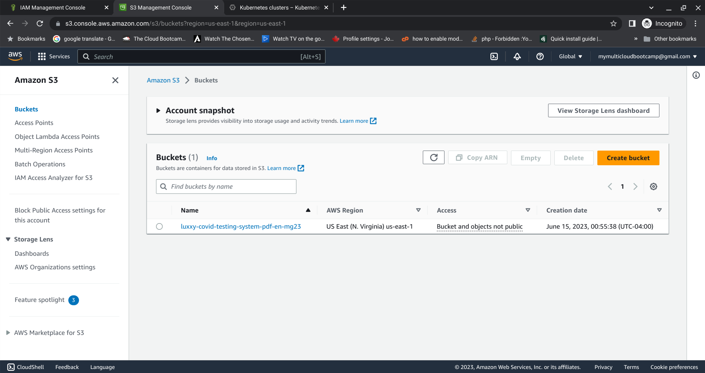
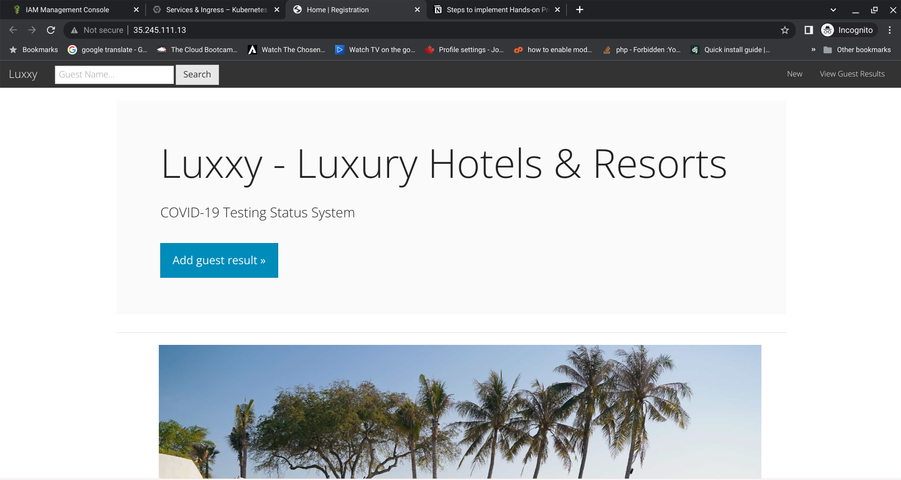
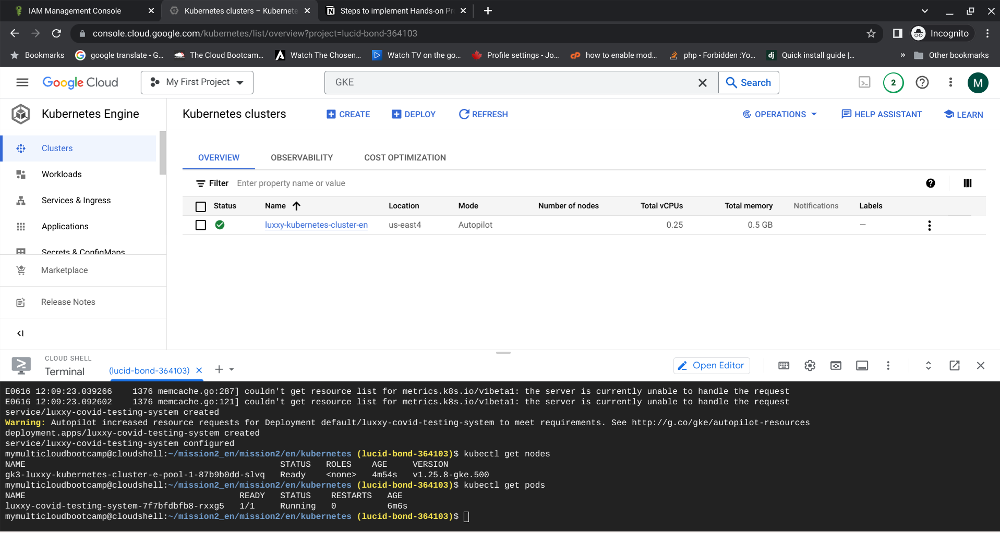
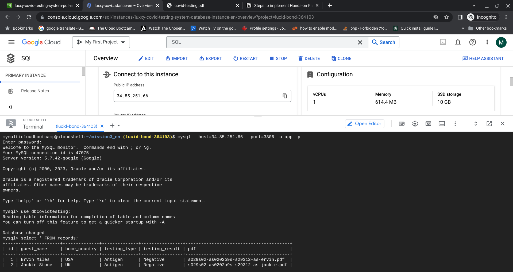
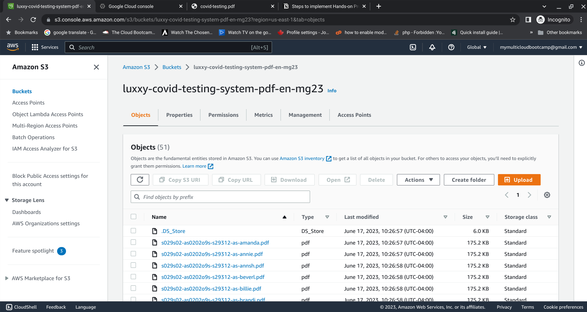

# Multi-Cloud Application Migration
### On-Premises → GCP (Kubernetes) + AWS S3 + Terraform IaC


---

## Overview

Full end-to-end migration of a legacy on-premises web application to a production-grade
multi-cloud architecture — infrastructure provisioned entirely with Terraform, application
containerized with Docker, deployed on Google Kubernetes Engine, database on GCP Cloud SQL,
and file storage on AWS S3.

Completed as part of [The Cloud Bootcamp](https://thecloudbootcamp.com) Intensive Cloud Training
and awarded a professional certificate (July 2023).

**Certificate:** [`docs/Michael Twagirayezu - 2023-07-03 - Multi-cloud cert.pdf`](docs/Michael%20Twagirayezu%20-%202023-07-03%20-%20Multi-cloud%20cert.pdf)

---

## Architecture

```
┌─────────────────────────────────────────────────────────────────┐
│                        MULTI-CLOUD ARCHITECTURE                 │
│                                                                 │
│   ┌─────────────────────────────────┐   ┌─────────────────┐    │
│   │        GOOGLE CLOUD PLATFORM    │   │       AWS        │    │
│   │                                 │   │                 │    │
│   │  ┌──────────────────────────┐   │   │  ┌───────────┐  │    │
│   │  │  Kubernetes Engine (GKE) │   │   │  │  S3 Bucket│  │    │
│   │  │  ┌────────────────────┐  │   │   │  │  (PDF     │  │    │
│   │  │  │  Flask App (Docker) │  │   │   │  │  files)   │  │    │
│   │  │  └────────────────────┘  │   │   │  └───────────┘  │    │
│   │  └──────────────────────────┘   │   └─────────────────┘    │
│   │                                 │                           │
│   │  ┌──────────────────────────┐   │                           │
│   │  │  Cloud SQL (MySQL)       │   │                           │
│   │  │  Patient test records    │   │                           │
│   │  └──────────────────────────┘   │                           │
│   └─────────────────────────────────┘                           │
│                                                                 │
│   Infrastructure provisioned with Terraform (IaC)              │
└─────────────────────────────────────────────────────────────────┘
```


---

## What This Project Demonstrates

- **Multi-Cloud Design** — workloads distributed across GCP and AWS based on best fit
- **Infrastructure as Code** — 100% of cloud resources provisioned via Terraform; no manual console clicks
- **Container Orchestration** — Dockerized Flask app deployed and managed on GKE
- **Database Migration** — MySQL schema creation and full data dump migrated to Cloud SQL
- **Object Storage Migration** — PDF file assets migrated to AWS S3
- **DevOps Workflow** — repeatable, scriptable deployment from credentials setup through app launch
- **Security Awareness** — credentials handled via CLI tools and env vars, never hardcoded

---

## Tech Stack

| Layer | Technology |
|-------|-----------|
| Infrastructure as Code | Terraform (`hashicorp/aws ~> 3.0`) |
| Container Runtime | Docker |
| Orchestration | GCP Kubernetes Engine (GKE) |
| Database | GCP Cloud SQL — MySQL |
| Object Storage | AWS S3 |
| Application | Python 3 / Flask |
| Frontend | Bootstrap 3, jQuery 3.2.1, Jinja2 templates |
| Credential Setup | Bash scripts (`aws_set_credentials.sh`, `gcp_set_project.sh`) |

---

## Project Structure

```
multicloud-hotel-migration/
├── app/                          # Flask web application
│   ├── app.py                    # Application entry point + routes
│   ├── config.py                 # Environment-based configuration
│   ├── models.py                 # Database models
│   ├── forms.py                  # WTForms form definitions
│   ├── helpers.py                # S3 upload helpers
│   ├── Dockerfile                # Container build instructions
│   ├── requirements.txt          # Python dependencies
│   ├── static/                   # CSS, JS, fonts, images
│   └── templates/                # Jinja2 HTML templates
│       ├── layouts/master.html
│       └── web/                  # home, records, new_record, edit_record
│
├── infrastructure/               # Terraform IaC
│   ├── main.tf                   # AWS provider config
│   ├── aws_variables.tf          # AWS region + credentials path
│   ├── gcp_variables.tf          # GCP project ID + region
│   ├── tcb_aws_storage.tf        # S3 bucket resource definition
│   ├── tcb_gcp_database.tf       # Cloud SQL instance definition
│   ├── aws_set_credentials.sh    # Sets up ~/.aws/credentials from CSV
│   └── gcp_set_project.sh        # Sets GCP project via gcloud
│
├── kubernetes/
│   └── luxxy-covid-testing-system.yaml   # GKE deployment + service manifest
│
├── db/
│   ├── create_table.sql          # MySQL schema
│   └── db_dump.sql               # Full data migration dump
│
└── docs/
    ├── certificate.pdf           # Cloud Bootcamp completion certificate
    ├── project-evidence.pdf      # Full project evidence document
    ├── Solution Architecture - Intensive Cloud Training.png
    └── screenshots/              # Evidence: running app, K8s cluster, S3, etc.
```

---

## The Three Missions

### Mission 1 — Provision Multi-Cloud Infrastructure with Terraform
- Created AWS S3 bucket for file storage
- Provisioned GCP Cloud SQL MySQL instance
- Provisioned GCP Kubernetes Engine cluster
- All resources defined in Terraform; no manual console interaction

**Evidence:**

| AWS S3 Provisioned | GKE Cluster Provisioned | Cloud SQL Provisioned |
|---|---|---|
|  |  |  |

---

### Mission 2 — Containerize and Deploy the Application
- Dockerized the Flask application
- Pushed container image to GCP Container Registry
- Deployed to GKE using Kubernetes manifest
- Connected app to Cloud SQL database and AWS S3

**Evidence:**

| App Running | Kubernetes Cluster |
|---|---|
|  |  |

---

### Mission 3 — Migrate Data and Files
- Ran `db_dump.sql` against Cloud SQL to migrate all records
- Uploaded 206 PDF patient test result files to AWS S3

**Evidence:**

| DB Migrated | PDFs in S3 |
|---|---|
|  |  |

---

## Prerequisites

- [Terraform CLI](https://developer.hashicorp.com/terraform/downloads) >= 1.0
- [Google Cloud SDK](https://cloud.google.com/sdk/docs/install) (`gcloud`)
- [AWS CLI](https://docs.aws.amazon.com/cli/latest/userguide/install-cliv2.html)
- [Docker](https://docs.docker.com/get-docker/)
- [kubectl](https://kubernetes.io/docs/tasks/tools/)
- GCP project with billing enabled
- AWS account with IAM user credentials

---

## Deployment Guide

### 1. Set credentials

```bash
# AWS — pass your accessKeys.csv (generate in IAM → never commit this file)
./infrastructure/aws_set_credentials.sh ./accessKeys.csv

# GCP — authenticate and set your project
gcloud auth login
gcloud config set project YOUR_GCP_PROJECT_ID
./infrastructure/gcp_set_project.sh
```

### 2. Provision infrastructure

```bash
cd infrastructure
terraform init
terraform plan
terraform apply
```

### 3. Build and push the Docker image

```bash
docker build -t gcr.io/YOUR_PROJECT_ID/luxxy-app ./app
docker push gcr.io/YOUR_PROJECT_ID/luxxy-app
```

### 4. Connect to GKE and deploy

```bash
gcloud container clusters get-credentials YOUR_CLUSTER_NAME --region us-east4
kubectl apply -f kubernetes/luxxy-covid-testing-system.yaml
kubectl get services   # copy the EXTERNAL-IP when ready
```

### 5. Migrate the database

```bash
# Connect to Cloud SQL instance via Cloud SQL Proxy or gcloud sql connect
# then run:
mysql -u root -p YOUR_DB < db/create_table.sql
mysql -u root -p YOUR_DB < db/db_dump.sql
```

### 6. Upload files to S3

```bash
aws s3 cp ./data/pdf_files/ s3://YOUR_BUCKET_NAME/ --recursive
```

---

## Security Notes

- `accessKeys.csv` and `.tfvars` files are blocked by `.gitignore` — never commit them
- GCP service account JSON keys should be passed via `GOOGLE_APPLICATION_CREDENTIALS` env var
- All Terraform variables use `var.*` references — no hardcoded credentials in any `.tf` file
- AWS credentials are stored in `~/.aws/credentials_multiclouddeploy` (local only)

---

## About

Built by **Michael Twagirayezu** — IT Systems Engineer and Multi-Cloud Architect based in Toronto, ON.

10+ years of enterprise IT experience across Canada, USA, and Rwanda. Specializing in
DevSecOps, AI integration, cloud infrastructure, and automation.

[](https://bio-two-eta.vercel.app)
[](https://linkedin.com/in/michael-twagirayezu)
[](https://github.com/MikeGira)

---

*The Cloud Bootcamp — Intensive Cloud Training · Certificate awarded July 3, 2023*
